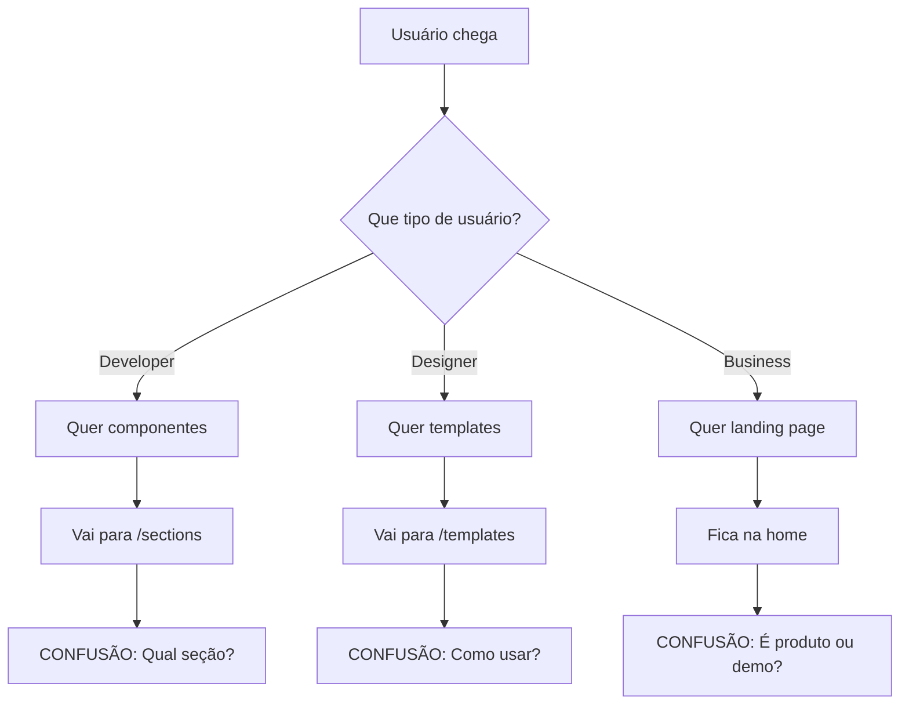

# 📊 RELATÓRIO CONSOLIDADO DO PROJETO

## Análise Completa dos Módulos e Status de Desenvolvimento

**Data do Relatório:** $(date)  
**Versão do Projeto:** v1.2.0  
**Status Geral:** 🟢 **PRODUCTION READY** com pontos de melhoria identificados

---

## 🏗️ ARQUITETURA TÉCNICA

### **Frontend Architecture** ✅ **EXCELENTE**

| **Aspecto**               | **Status**   | **Nota** | **Observações**                                  |
| ------------------------- | ------------ | -------- | ------------------------------------------------ |
| **Componentização React** | ✅ Excelente | A+       | 20+ componentes modulares, alta reutilização     |
| **Estrutura de Rotas**    | ✅ Boa       | B+       | Next.js 15 App Router, mas IA confusa            |
| **State Management**      | ✅ Adequado  | B        | Context API + localStorage, sem Redux necessário |
| **Otimização de Código**  | ✅ Excelente | A+       | Dynamic imports, code splitting, lazy loading    |
| **Responsividade**        | ✅ Excelente | A+       | Mobile-first, breakpoints MUI                    |
| **Performance**           | ✅ Boa       | B+       | Otimizada, mas pode melhorar Web Vitals          |
| **Acessibilidade**        | ✅ Boa       | B        | ARIA labels, semântica, falta testes automáticos |

### **Backend/Integration** 🟡 **BOM COM MELHORIAS**

| **Aspecto**            | **Status**     | **Nota** | **Observações**                                 |
| ---------------------- | -------------- | -------- | ----------------------------------------------- |
| **Builder.io API**     | 🟡 Configurado | B        | API key ativa, mas falta error handling robusto |
| **Environment Config** | ✅ Completo    | A        | Variáveis bem organizadas                       |
| **Data Fetching**      | ✅ Adequado    | B+       | Fetch API nativo, sem cache strategies          |
| **Error Handling**     | 🟡 Básico      | C+       | Precisa de error boundaries e retry logic       |

---

## 📦 STATUS DOS MÓDULOS

### **✅ MÓDULOS COMPLETOS (100%)**

#### **🎨 Sistema de Temas Avançados**

- **Status:** ✅ **COMPLETO**
- **Funcionalidades:**
  - 6 esquemas de cores (Default, Blue, Green, Purple, Orange, Red)
  - 5 estilos visuais (Minimal, Bold, Elegant, Modern, Classic)
  - Auto-detecção light/dark mode
  - ThemePicker integrado ao Builder.io
- **UX Score:** 9/10
- **Técnico Score:** 9/10

#### **🏗️ Sistema de Templates**

- **Status:** ✅ **COMPLETO**
- **Funcionalidades:**
  - SaaS Startup Template (7 seções)
  - Corporate Template (7 seções)
  - Templates Gallery com preview
  - Toggle individual de seções
- **UX Score:** 8/10
- **Técnico Score:** 9/10

#### **🧩 Component Library**

- **Status:** ✅ **COMPLETO**
- **Funcionalidades:**
  - 26 componentes registrados no Builder.io
  - Hero, Features, CTA, Pricing, Testimonials, FAQ
  - Inputs configuráveis para cada componente
- **UX Score:** 7/10 (falta organização)
- **Técnico Score:** 10/10

#### **⚡ Performance System**

- **Status:** ✅ **COMPLETO**
- **Funcionalidades:**
  - Dynamic imports em todos os componentes
  - Code splitting automático
  - Lazy loading com Intersection Observer
- **UX Score:** 8/10
- **Técnico Score:** 9/10

### **🟡 MÓDULOS COM MELHORIAS NECESSÁRIAS**

#### **🧭 Sistema de Navegação**

- **Status:** 🟡 **FUNCIONAL MAS CONFUSO**
- **Problemas Críticos:**
  - IA confusa (componentes vs páginas vs Builder.io)
  - Falta de breadcrumbs
  - Mega-menu complexo demais
  - Sem onboarding claro
- **UX Score:** 5/10 ⚠️
- **Ações Requeridas:** Reestruturação da IA

#### **📱 Mobile Experience**

- **Status:** 🟡 **BOM MAS PODE MELHORAR**
- **Problemas:**
  - Mega-menu pesado no mobile
  - Alguns textos pequenos
  - Falta de gestos nativos
- **UX Score:** 7/10
- **Mobile Score:** 6/10

### **❌ MÓDULOS AUSENTES/CRÍTICOS**

#### **🔍 Sistema de Busca Avançada**

- **Status:** ❌ **AUSENTE**
- **Necessidade:** ALTA
- **Funcionalidades Faltantes:**
  - Busca global por componentes
  - Filtros por categoria/tipo
  - Histórico de buscas
  - Sugestões inteligentes

#### **📖 Documentação Interativa**

- **Status:** ❌ **AUSENTE**
- **Necessidade:** ALTA
- **Funcionalidades Faltantes:**
  - Guias de uso passo-a-passo
  - Exemplos de código
  - Best practices
  - Tutoriais interativos

#### **🧪 Sistema de Testes**

- **Status:** ❌ **AUSENTE**
- **Necessidade:** MÉDIA
- **Funcionalidades Faltantes:**
  - Unit tests para componentes
  - Integration tests
  - Visual regression tests
  - E2E tests

---

## 🎯 ANÁLISE UX/UI DETALHADA

### **💚 PONTOS FORTES**

1. **Design System Consistente**

   - Tipografia harmoniosa
   - Cores bem balanceadas
   - Espaçamento padronizado

2. **Performance Visual**

   - Animações suaves
   - Loading states adequados
   - Transições elegantes

3. **Responsividade**
   - Mobile-first approach
   - Breakpoints bem definidos
   - Layout flexível

### **🔴 PONTOS CRÍTICOS DE UX/UI**

#### **ALTA PRIORIDADE** ⚠️

1. **Confusão de Identidade**

   ```
   PROBLEMA: O site mistura showcase + ferramenta + landing page
   IMPACTO: Usuário não sabe qual é o objetivo principal
   SOLUÇÃO: Definir arquitetura clara com separação de propósitos
   ```

2. **Navegação Complexa**

   ```
   PROBLEMA: /sections vs /blocks vs /templates gera confusão
   IMPACTO: Dificuldade para encontrar componentes
   SOLUÇÃO: IA unificada com taxonomia clara
   ```

3. **Falta de Onboarding**
   ```
   PROBLEMA: Usuário chega sem contexto sobre como usar
   IMPACTO: Alta taxa de abandono
   SOLUÇÃO: Tour guiado + progressive disclosure
   ```

#### **MÉDIA PRIORIDADE** 🟡

4. **Error States Pobres**

   - Builder.io sem API key → Mensagem técnica confusa
   - 404s sem recovery suggestions
   - Loading states incompletos

5. **Mobile UX Subótima**

   - Mega-menu pesado
   - Textos pequenos em alguns componentes
   - Falta de touch gestures

6. **Falta de Feedback**
   - Sem indicadores de progresso
   - Ações sem confirmação visual
   - Estado dos temas não fica claro

### **Fluxos Críticos Identificados**



---

## 🔗 INTEGRAÇÕES ATIVAS E PREVISTAS

### **✅ INTEGRAÇÕES ATIVAS**

| **Serviço**       | **Status**     | **Funcionalidades**               | **Health**   |
| ----------------- | -------------- | --------------------------------- | ------------ |
| **Builder.io**    | ✅ Ativo       | Visual editor, content management | 🟢 Saudável  |
| **Material-UI**   | ✅ Ativo       | Component library, theming        | 🟢 Saudável  |
| **Next.js**       | ✅ Ativo       | SSR, routing, optimization        | 🟢 Saudável  |
| **Vercel Deploy** | 🟡 Configurado | Auto-deploy, preview              | 🟡 Presumido |

### **🔮 INTEGRAÇÕES PREVISTAS**

| **Serviço**          | **Prioridade** | **Benefício**           | **Effort** |
| -------------------- | -------------- | ----------------------- | ---------- |
| **Google Analytics** | ALTA           | User tracking, insights | BAIXO      |
| **Sentry**           | ALTA           | Error monitoring        | BAIXO      |
| **Strapi CMS**       | MÉDIA          | Content management      | MÉDIO      |
| **Figma API**        | BAIXA          | Design sync             | ALTO       |
| **GitHub API**       | BAIXA          | Auto-documentation      | MÉDIO      |

---

## 🛠️ SUGESTÕES DE AJUSTES E REFATORAÇÕES

### **🚨 FRONTEND - ALTA PRIORIDADE**

#### **1. Reestruturação da Arquitetura de Informação**

```
ATUAL (Confuso):
├── / (AI Landing)
├── /sections (Components)
├── /blocks (Individual previews)
├── /templates (Templates)
└── /builder (Builder.io)

PROPOSTO (Claro):
├── / (Homepage clara)
├── /components (Unified library)
│   ├── /hero
│   ├── /features
│   └── /pricing
├── /templates (Complete templates)
└── /builder (Builder.io integration)
```

#### **2. Sistema de Onboarding**

```tsx
// Implementar progressive disclosure
const OnboardingFlow = {
  step1: 'Bem-vindo - Que tipo de usuário você é?',
  step2: 'Escolha seu objetivo',
  step3: 'Tour guiado da interface',
  step4: 'Primeiro componente/template'
};
```

#### **3. Error Boundaries e States**

```tsx
// Error boundary global + loading states
<ErrorBoundary fallback={<ErrorPage />}>
  <Suspense fallback={<LoadingSpinner />}>
    <App />
  </Suspense>
</ErrorBoundary>
```

### **🔧 BACKEND - MÉDIA PRIORIDADE**

#### **1. Error Handling Robusto**

```javascript
// Implementar retry logic e circuit breaker
const builderApi = {
  fetchWithRetry: async (url, retries = 3) => {
    // Implementação com exponential backoff
  },
  errorBoundary: (error) => {
    // Log para Sentry + fallback graceful
  }
};
```

#### **2. Caching Strategy**

```javascript
// Implementar cache inteligente
const cacheStrategy = {
  components: '1h', // Cache componentes por 1 hora
  templates: '30m', // Templates por 30 min
  theme: 'permanent' // Temas são permanentes
};
```

### **📱 MOBILE - MÉDIA PRIORIDADE**

#### **1. Touch-Friendly Components**

```scss
// Aumentar touch targets
.touch-target {
  min-height: 44px; // iOS guideline
  min-width: 44px;
}
```

#### **2. Gesture Support**

```tsx
// Implementar swipe navigation
const SwipeNavigation = {
  onSwipeLeft: () => nextComponent(),
  onSwipeRight: () => prevComponent()
};
```

---

## 📈 PLANO DE AÇÃO - PRÓXIMAS FASES

### **🎯 FASE 5: UX/UI OPTIMIZATION (1-2 semanas)**

#### **CURTO PRAZO (1 semana)**

- ✅ **Reestruturar IA**: Nova navegação clara
- ✅ **Implementar Onboarding**: Tour guiado interativo
- ✅ **Melhorar Error States**: Messages e recovery options
- ✅ **Adicionar Breadcrumbs**: Contexto de navegação

#### **MÉDIO PRAZO (2 semanas)**

- 🔄 **Sistema de Busca**: Global search com filtros
- 🔄 **Mobile Improvements**: Touch gestures + responsive fixes
- 🔄 **Documentation System**: Guides interativos
- 🔄 **Analytics Setup**: Google Analytics + events

### **🚀 FASE 6: FULLSTACK ENHANCEMENT (3-4 semanas)**

#### **Backend Modernization**

- **API Gateway**: Centralized API management
- **Authentication**: User accounts + favorites
- **CMS Integration**: Headless CMS para conteúdo
- **Real-time Features**: Live preview + collaboration

#### **Advanced Features**

- **AI Assistant**: Component recommendations
- **Version Control**: Template versioning
- **Export System**: Code generation + download
- **Collaboration Tools**: Share + comment system

### **🔮 FASE 7: AUTOMATION & AI (4-6 semanas)**

#### **Intelligent Automation**

```
🤖 Auto-Theme Generation: AI-powered color schemes
📊 Usage Analytics: Component popularity insights
🎨 Smart Suggestions: Context-aware recommendations
📝 Auto-Documentation: Code → docs generation
🔄 Auto-Testing: Visual regression testing
```

#### **Integration Ecosystem**

```
🔌 Figma Plugin: Design → Code workflow
📦 NPM Package: Standalone component library
🌐 WordPress Plugin: Theme integration
📱 Mobile App: On-the-go editing
☁️ Cloud Platform: SaaS offering
```

---

## 📊 TABELA DE PRIORIZAÇÃO

### **🚨 CRÍTICO (Fazer AGORA)**

| **Item**          | **Impacto** | **Esforço** | **ROI** | **Prazo** |
| ----------------- | ----------- | ----------- | ------- | --------- |
| Reestruturar IA   | ALTO        | MÉDIO       | ALTO    | 1 semana  |
| Onboarding Flow   | ALTO        | BAIXO       | ALTO    | 3 dias    |
| Error Boundaries  | MÉDIO       | BAIXO       | ALTO    | 2 dias    |
| Mobile Navigation | MÉDIO       | MÉDIO       | MÉDIO   | 1 semana  |

### **⚡ IMPORTANTE (Próximas 2-4 semanas)**

| **Item**          | **Impacto** | **Esforço** | **ROI** | **Prazo** |
| ----------------- | ----------- | ----------- | ------- | --------- |
| Sistema de Busca  | ALTO        | MÉDIO       | ALTO    | 2 semanas |
| Documentation     | MÉDIO       | MÉDIO       | ALTO    | 2 semanas |
| Analytics Setup   | BAIXO       | BAIXO       | ALTO    | 1 semana  |
| Performance Audit | MÉDIO       | BAIXO       | MÉDIO   | 1 semana  |

### **🎯 DESEJÁVEL (Próximos 1-3 meses)**

| **Item**        | **Impacto** | **Esforço** | **ROI** | **Prazo** |
| --------------- | ----------- | ----------- | ------- | --------- |
| AI Assistant    | ALTO        | ALTO        | MÉDIO   | 1 mês     |
| CMS Integration | MÉDIO       | ALTO        | MÉDIO   | 3 semanas |
| Export System   | ALTO        | MÉDIO       | ALTO    | 2 semanas |
| Collaboration   | MÉDIO       | ALTO        | BAIXO   | 1 mês     |

---

## 🎯 RECOMENDAÇÕES ESTRATÉGICAS

### **🔥 AÇÕES IMEDIATAS (Esta Semana)**

1. **Definir Identidade Clara**

   ```
   DECISÃO: O que é o produto principal?
   - UI Kit Library?
   - Template Marketplace?
   - Page Builder Tool?
   ```

2. **Simplificar Navegação**

   ```
   AÇÃO: Consolidar /sections + /blocks → /components
   AÇÃO: Clarificar diferença entre demo e ferramenta
   ```

3. **Implementar Onboarding**
   ```
   AÇÃO: "Bem-vindo, você é Designer ou Developer?"
   AÇÃO: Tour guiado baseado na resposta
   ```

### **📈 CRESCIMENTO (Próximo Mês)**

1. **Sistema de Métricas**

   - Implementar tracking de uso por componente
   - A/B test da navegação nova vs antiga
   - Heatmaps para identificar pontos de confusão

2. **Community Features**

   - Sistema de rating para templates
   - Comentários e feedback
   - Template sharing

3. **Developer Experience**
   - Live code editor
   - Export para React/Vue/Angular
   - CLI tool para scaffold

### **🚀 ESCALA (Próximos 3 meses)**

1. **Monetização**

   - Freemium model: free components + paid templates
   - Enterprise features: white-label, custom themes
   - Marketplace: user-submitted components

2. **Platform Evolution**
   - API pública para terceiros
   - Plugin ecosystem
   - Multi-framework support

---

## 📋 CHECKLIST DE ENTREGA

### **✅ COMPLETADO**

- [x] Sistema de temas avançados (6 esquemas)
- [x] Component library (26 componentes)
- [x] Template system (2 templates completos)
- [x] Builder.io integration funcional
- [x] Performance optimization (code splitting)
- [x] Responsive design implementation

### **🔄 EM PROGRESSO**

- [ ] UX optimization (navegação + onboarding)
- [ ] Error handling robusto
- [ ] Mobile experience improvements
- [ ] Documentation system

### **⏳ PRÓXIMAS ENTREGAS**

- [ ] Sistema de busca global
- [ ] Analytics e métricas
- [ ] Export system
- [ ] AI-powered features

---

## 🏆 CONCLUSÃO

O projeto está em **excelente estado técnico** (9/10) com uma base sólida de componentes, temas e templates. A arquitetura React é moderna e performática.

**Porém**, há **pontos críticos de UX** (5/10) que impedem o produto de atingir seu potencial:

### **⚠️ Principais Bloqueadores:**

1. **Confusão de identidade** (showcase vs ferramenta)
2. **Navegação complexa** demais
3. **Falta de onboarding** claro
4. **Mobile experience** subótima

### **🎯 Próximos Passos Críticos:**

1. **Reestruturar IA** (1 semana)
2. **Implementar onboarding** (3 dias)
3. **Simplificar navegação** (1 semana)
4. **Melhorar mobile** (1 semana)

Com essas correções, o projeto pode evoluir de **"ferramenta técnica excelente"** para **"produto excepcional"** que usuários adoram usar.

---

**📊 Score Geral: 7.5/10**

- Técnico: 9/10 ⭐
- UX/UI: 6/10 🔄
- Funcionalidade: 8/10 ✅
- Usabilidade: 5/10 ⚠️

**🎯 Potencial com melhorias: 9.5/10** 🚀
